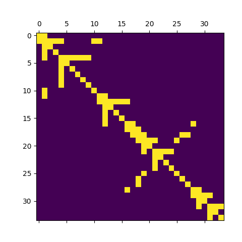

# Transform_AST_to_JSON

This repository provides program for transforming AST to JSON file.

## Prerequisite

To use the program, you are required to install some needed libraries.

```
pip3 install tree_sitter
git clone https://github.com/tree-sitter/tree-sitter-javascript
git clone https://github.com/tree-sitter/tree-sitter-java
git clone https://github.com/tree-sitter/tree-sitter-python
```

Besides, you need to save your code in a **txt** file that is more convenient for input.

## Usage

To run this program, here is the usage.

```
python3 transform_ast_to_json.py --data_dir (where all the txt files that you want to transform are saved) 
\--save_dir (the place you want to save the jsonl file and matrix) 
\--language (your code's language) 
\--saving_matrix (type 1 or 0 to determine whether you want to save the adjacent matrix or not)
e.g. python3 transform_ast_to_json.py --data_dir test \
--save_dir save --language python --saving_matrix 1
```

Notice that:

- In each data directory, you must save the txt files of same languages.
- You need to save the txt file in the following sequence:
  - data_dir/[name1].txt
  - data_dir/[name2].txt

For saving, the program will generate a dictionary for each source code. Then it will save all those dictionaries into one jsonline file called 'saving.jsonl' in sequence. To avoid overlap, please use different saving directory while processing different groups of source codes.

The program currently supports python, java, and javascript. If you want to transform other languages, you may need to git clone the library you need and edit the source code of the program. 

## Example

### Source Code

```
def foo(a,b):
    if bar:
        (a+b)*2
        baz()
```

### Generated JSONL File (one line)

```
{
  "Node(type='module', start=(0, 0), end=(3, 13), id=0)": {
    "Node(type='function_definition', start=(0, 0), end=(3, 13), id=1)": {
      "Node(type='def', start=(0, 0), end=(0, 3), id=2)": {},
      "Node(type='identifier', start=(0, 4), end=(0, 7), id=3)": {},
      "Node(type='parameters', start=(0, 7), end=(0, 12), id=4)": {
        "Node(type='(', start=(0, 7), end=(0, 8), id=5)": {},
        "Node(type='identifier', start=(0, 8), end=(0, 9), id=6)": {},
        "Node(type=',', start=(0, 9), end=(0, 10), id=7)": {},
        "Node(type='identifier', start=(0, 10), end=(0, 11), id=8)": {},
        "Node(type=')', start=(0, 11), end=(0, 12), id=9)": {}
      },
      "Node(type=':', start=(0, 12), end=(0, 13), id=10)": {},
      "Node(type='block', start=(1, 4), end=(3, 13), id=11)": {
        "Node(type='if_statement', start=(1, 4), end=(3, 13), id=12)": {
          "Node(type='if', start=(1, 4), end=(1, 6), id=13)": {},
          "Node(type='identifier', start=(1, 7), end=(1, 10), id=14)": {},
          "Node(type=':', start=(1, 10), end=(1, 11), id=15)": {},
          "Node(type='block', start=(2, 8), end=(3, 13), id=16)": {
            "Node(type='expression_statement', start=(2, 8), end=(2, 15), id=17)": {
              "Node(type='binary_operator', start=(2, 8), end=(2, 15), id=18)": {
                "Node(type='parenthesized_expression', start=(2, 8), end=(2, 13), id=19)": {
                  "Node(type='(', start=(2, 8), end=(2, 9), id=20)": {},
                  "Node(type='binary_operator', start=(2, 9), end=(2, 12), id=21)": {
                    "Node(type='identifier', start=(2, 9), end=(2, 10), id=22)": {},
                    "Node(type='+', start=(2, 10), end=(2, 11), id=23)": {},
                    "Node(type='identifier', start=(2, 11), end=(2, 12), id=24)": {}
                  },
                  "Node(type=')', start=(2, 12), end=(2, 13), id=25)": {}
                },
                "Node(type='*', start=(2, 13), end=(2, 14), id=26)": {},
                "Node(type='integer', start=(2, 14), end=(2, 15), id=27)": {}
              }
            },
            "Node(type='expression_statement', start=(3, 8), end=(3, 13), id=28)": {
              "Node(type='call', start=(3, 8), end=(3, 13), id=29)": {
                "Node(type='identifier', start=(3, 8), end=(3, 11), id=30)": {},
                "Node(type='argument_list', start=(3, 11), end=(3, 13), id=31)": {
                  "Node(type='(', start=(3, 11), end=(3, 12), id=32)": {},
                  "Node(type=')', start=(3, 12), end=(3, 13), id=33)": {}
                }
              }
            }
          }
        }
      }
    }
  }
}
```

### Adjacent Matrix (for one source code)

